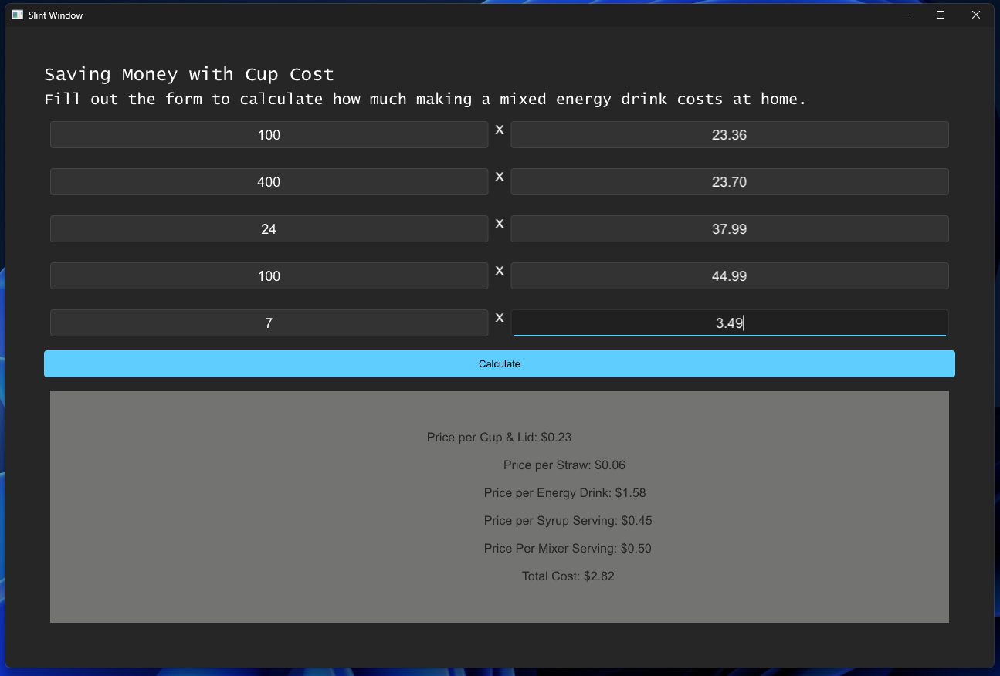

# Cup Cost

My first GUI Rust Application using the Rust Language and Slint framework.

## About

I wanted to test out what I have learned so far (1/7/2024) with the Rust programming language and I came across the Slint framework. This application took a little over 4 hours of tinkering with. I still need to format the output window text. The goal of this application was to build a tool that is practicle for me rather than another toy application. Lately, I have been going to a coffee shop near me and getting a Mocktail drink, which is made with a Redbull, syrup, and lemonade. I wanted to create an application that would calculate materials and consumables I purchase off Amazon & the grocery store in order to make my own mocktail. 

If you are curious what a mocktail is: Add Ice to a 24oz cup, Pour in a 8oz can of Sugar Free Redbull, Two pumps of your favorite Torani flavored syrup, and 8oz of light lemonade. If you dont care about calories as much, subsitute for full versions (regular redbull and regular lemonade). They are also good with Orange Juice, Cranberry Juice, and Grape Juice.

## Preview

