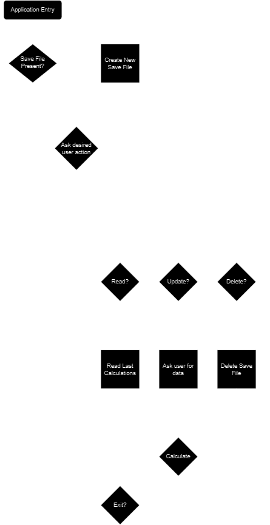

# Retirement Command Line Application

The goal of this project is to advance my skills on creating an application without following a guide, tutorial, or course. I want to create an application without any hand holding, regardless of how good the code is or not. This is my first true attempt and creating an application from an idea without any clear guidance on how to accomplish it. Also disclaimer, I got my toes wet with The Rust Programming Language book and skipped ahead to Chapter 12 from Chapter 7 which probably wasn't smart to do. But I only got a few pages in before I paused that. I want to see if I can make this without going through the entire chapter where you make a command line application, just to test my knowledge so far. Projects really are the best way to learn, or so they say.

Application Idea: Ask the user for data regarding monthly income, monthly bills, and then calculate what the user should contribute to retirement. 

## Problems & Solutions:

In this readme file I will document my process of breaking the macro problem (creating an application) into micro problems and solving them.

### Problem #1: Where do I begin?

As I have never created an application in any language from scratch without a text book, course, or guide I didn't really know how to begin. I first opened VSCode and attempted to hand jam some code together but I just didn't know how to proceed. So my solution to this was to create a 'Application Flow' diagram. Just so I would have visual representation of what I needed to create. 



This is what I came up with. Seems simple enough for a mvp. 

---

### Problem 2: How do I get a terminal application to stop closing in rust?

Looking at the application flow diagram I made, it looked like the Exit function was probably the best thing to start with. I have a little experience with keeping terminal applications open that I have learned from courses I took pursuing a bachelors degree, and some textbooks I have read. 

My first solution was to create a bool variable in main that is responsible for telling the console to keep running or not. I also wanted to add a little more functionality to a console application like colorizing words, but I didn't want to get scope creep so I decided to level up my skills in finding crates that handle this and I found a crate called [console](https://crates.io/crates/console); this crate is a library that provides access to various terminal features so you can build nicer looking command line interfaces. It comes with various tools and utilities for working with Terminals and formatting text. 

The creator of console also created another crate named [dialoguer](https://crates.io/crates/dialoguer) which I decided to add as well for the exit logic. This crate gives me an easy confirmation prompt as well as other features like input prompts, input validation, selections prompts, and fuzzy select prompts that I may need to use in other functions for this application. 

With those crates added to my project, I created the basic exit function that asks the user if they want to continue running the application, prints some stylized text based on the choice, and returns a bool. I can then call this function on the last line of my main function to create a loop that will continue to run the application until the user says no and then that false boolean updates the bool for the while loop.  

This is a very basic and probably a janky way of keeping the terminal open but it does what I need it to do until I learn the best practices for it. 

---

### Problem 3: How am I going to ask the user for their expensives and where do I store it?

This seems like a macro problem to me as there are so many moving parts but I am going to digest it into bit sized chunks. Because not every user will have the same bills or utilities I am going to have to implement a system that allows the user to input what bills they have, then ask them for the amounts they pay. Next, I am going to have to take those values and store them in a file. After that, I will need a means of retrieving the data from a save file and ask them if they want to update it. 

First, I looked for crates that would allow the user to make selections from a list. On crates.io I found [requestty](https://crates.io/crates/requestty) crate that is 'an easy-to-use collection of interactive cli prompts'. This crate will actually suffice for a multitude of things. It will allow me to be able to ask questions to the user, implement passwords, use confirmations like in the exit method, ask for integers, ask for floats (this is exactly what I need for asking expenses), use a select (which will help at the main menu), and have a multi-select option which is what I need for asking which common expenses the user has. I will just be creating another problem I have to solve in the future, "how do you remove a crate since I first utilized console and dialoguer crates and don't want them to be part of the end application?".

Now that I have an interactive means to ask the user for data, I need to make the variables of common expenses and store it somewhere. 

---

### Problem 4: 'easy-to-use' crate not so easy

I attempted to refactor my exit code with the confirm from the requestty crate and I ran into a brick wall. I could not figure out how to extract the boolean from the confirm question. The only thing the example showed how to store the boolean is with:

```Rust
    let question = requestty::Question::confirm("anonymous")
        .message("Do you want to remain anonymous?")
        .build();
```

Then to display it in the terminal with `println!("{:#?}", requestty::prompt_one(question));`. But all that does is just print the value using the debug formatter. I have no idea how to extract the the boolean from it. 